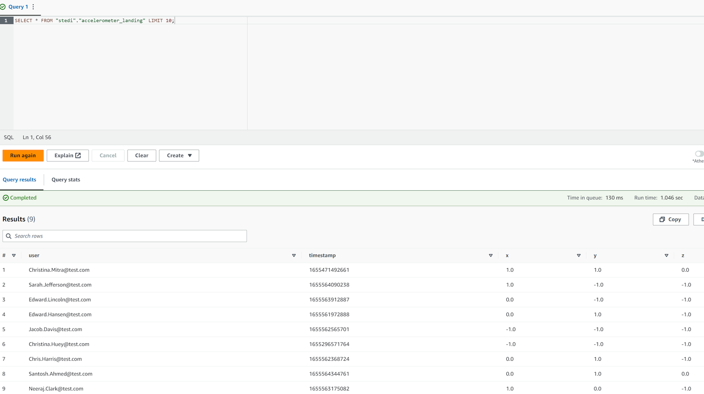

# Final Project: STEDI Human Balance Analytics
## Project Description

The STEDI Team is diligently working on developing a hardware STEDI Step Trainer that serves three purposes. Firstly, the equipment will train the user to perform a STEDI balance exercise. Secondly, the device comes equipped with sensors that collect data, which will then train a machine-learning algorithm to detect steps. Lastly, there is a companion mobile app that collects customer data and interacts with the device sensors.

Millions of early adopters are willing to purchase the STEDI Step Trainers and use them, with several customers having already received their Step Trainers, installed the mobile application, and begun using them to test their balance. The Step Trainer only operates as a motion sensor, measuring the distance of the detected object. Meanwhile, the mobile app utilizes a mobile phone accelerometer, detecting motion in the X, Y, and Z directions.

The STEDI team aims to train a machine learning model to accurately detect steps in real-time using motion sensor data as input while considering privacy as a primary issue when deciding which data can be employed. For research purposes, some early adopters have agreed to share their data. Only data from these customers' Step Trainer and accelerometer should be used as the ML model's training data.

## Implementation
### Landing Zone
#### Glue table
- [accelerometer_landing.sql](SQL/DDL/accelerometer_landing.sql)
- [customer_landing.sql](SQL/DDL/customer_landing.sql)

#### Athena

`Accelerometer Landing`:

<figure>
  
</figure>

`Customer Landing`:

<figure>
  
</figure>

### Trusted Zone

**Glue scripts**:

- [customer_landing_to_trusted.py](GlueScripts/customer_landing_to_trusted.py)
- [accelerometer_landing_to_trusted_zone.py](GlueScripts/accelerometer_landing_to_trusted.py)

**Athena**:
`Trusted Zone`:

<figure>
  
</figure>

### Curated Zone

`Glue scripts`:

- [customer_trusted_to_curated.py](GlueScripts/customer_trusted_to_curated.py)
- [trainer_trusted_to_curated.py](GlueScripts/trainer_trusted_to_curated.py)

